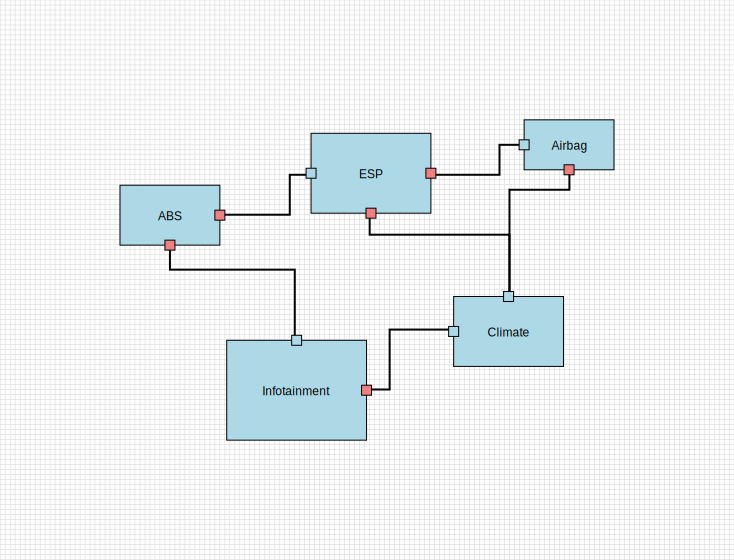
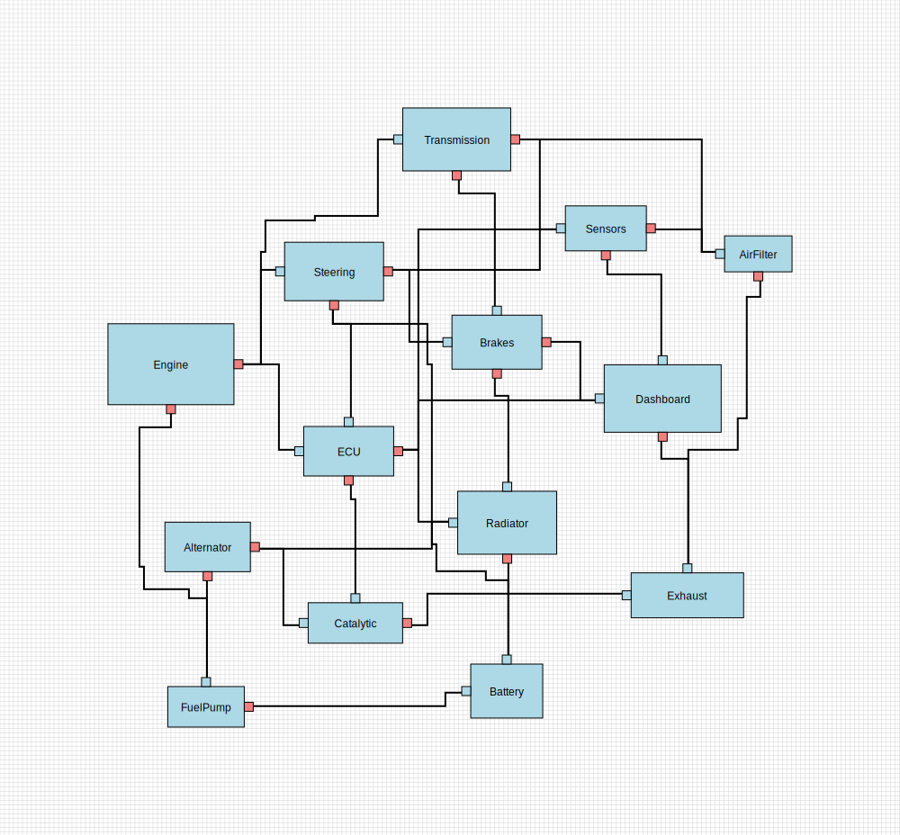

# ArciVis Layout

A Rust library for automatic graph layout and edge routing, designed for architectural visualization and diagram generation.

## Examples

The library comes with 6 comprehensive test sets that demonstrate various layout scenarios. Each test set can be rendered to SVG for visualization.

### Test Set 1: Basic Network Topology


> Note: Option selected to show all ports, even unconnected

### Test Set 2: More Complex Structure


> Note: Unconnected ports are hidden, grid is hidden

### Test Set 3: Automotive Safety & Comfort Systems


> Note: For this example the ports are centered on the edges of the node

### Test Set 4: Complex Automotive System


### Test Set 5: Automotive ECU Network with separate bus and Ethernet cluster entities


### Test Set 6: Test set with much bigger nodes (from viewer example)


> Note: Aditionally the forbidden routing area is marked red

The SVG diagrams shown above are generated automatically when running `cargo test`. The test cases in `tests/layout.rs` create these visualizations to demonstrate different layout scenarios.

## Example application

The crate includes an example application that demonstrates how to use the layout library with JSON input files.

### Usage

```bash
cargo run --example layout_example <input.json> <output.svg>
```

### Input Format

The example expects a JSON file with the following structure:

```json
{
  "nodes": [
    {
      "id": "NodeName",
      "size": {"width": 100.0, "height": 50.0},
      "position": {"x": 0.0, "y": 0.0},
      "ports": [
        {
          "position": {"x": 100.0, "y": 20.0},
          "size": {"width": 10.0, "height": 10.0},
          "port_type": "Output",
          "id": null
        }
      ],
      "attributes": []
    }
  ],
  "edges": [
    {
      "source": 0,
      "target": 1,
      "source_port": 0,
      "target_port": 0,
      "path": []
    }
  ]
}
```

### Features

- **JSON Input**: Load graph data from JSON files
- **Automatic Layout**: Applies the full layout algorithm including force-directed positioning and edge routing
- **SVG Output**: Generates scalable vector graphics for visualization
- **Port Support**: Handles nodes with input/output ports for precise edge connections
- **Default Configuration**: Uses sensible defaults for layout parameters

### Running the example

A sample input file is provided at `examples/example.json` which demonstrates a simple workflow with ports:

```bash
cargo run --example layout_example examples/example.json workflow.svg
```

This will generate an SVG file showing a Start → Process1 → Process2 → End workflow with proper port connections.

## Design Documentation

- [Algorithm](doc/design/algorithm.md) - Detailed description of the layout algorithm phases
- [Architecture](doc/design/architecture.md) - Core components, features, and technical details
- [Performance & Architecture Improvements](doc/design/improvements.md) - Proposed optimizations and enhancements

## Used By

- [ArciVis GPUI](https://github.com/christianjann/arcivis-gpui) (interactive graph visualization and layout of vehicle E/E architectures)
